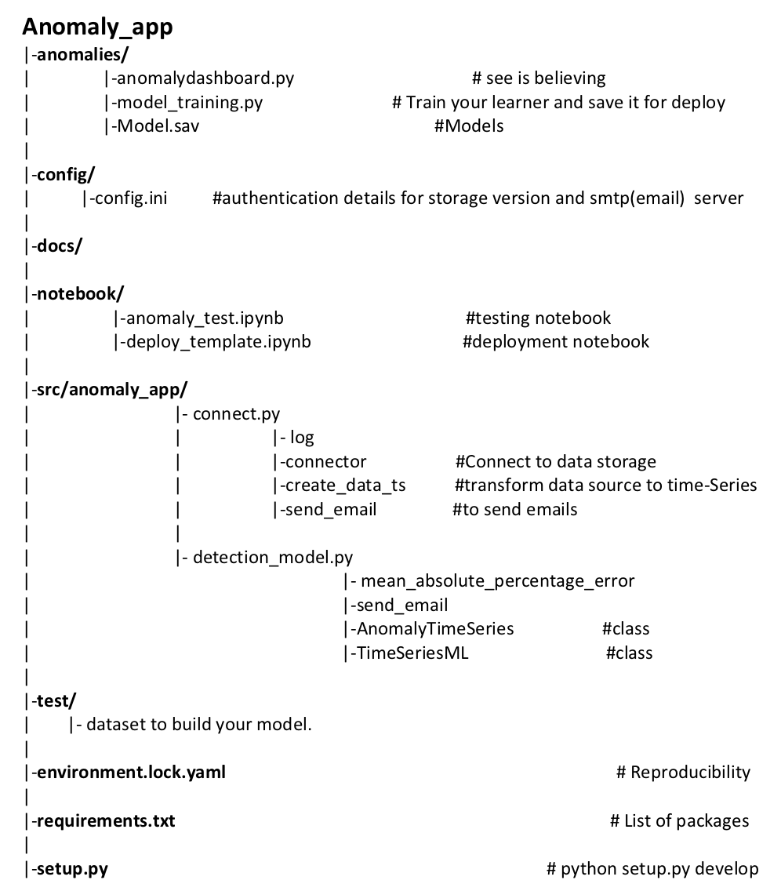

ML framework for Timeseries Anomaly Application
======================

### Description
The framework is developed to extract dataset from source (SQL), train models and deploy to provide notifcation in case there is anomaly in the live data and provide dashboard.

A longer description of your project goes here...

Note
====
